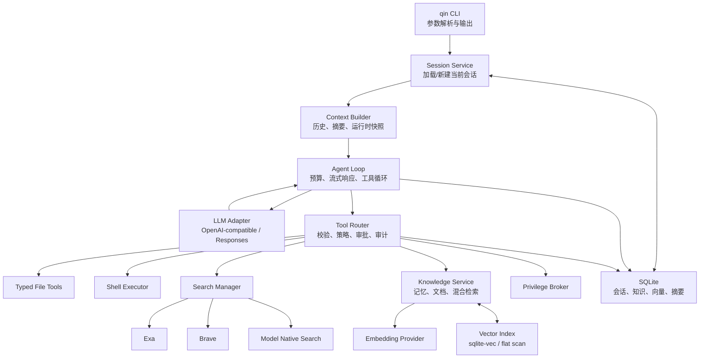

# qin：基于 Rust 的一次性命令行 Agent 方案说明

> 本文记录完整的目标架构和后续演进方向，并不代表所有候选能力均已实现。当前可用行为以 `README.md`、生成的配置文件和 `AUDIT.md` 为准；尤其是跨调用 tmpfs spool 仍是未来方案，当前 OpenWrt 优化采用单次调用批量事务、PERSIST journal、f16 向量和延迟自动记忆提取。

## 1. 项目目标

`qin` 是一个运行于 Linux、macOS 和 OpenWrt 命令行环境的本地 Agent。用户通过自然语言描述任务，`qin` 调用已配置的 OpenAI 兼容模型，由模型规划并调用本地工具完成任务，然后退出并返回原命令行。

典型调用：

```bash
qin "帮我把 xxx 目录下的所有文件移动到当前目录"
qin new
qin new "检查当前目录并修复构建错误"
sudo qin "把生成的配置安装到 /etc/myapp"
```

核心产品约束：

- 一次调用完成一轮或多轮模型/工具循环，任务结束后进程退出，不常驻。
- 普通 `qin "..."` 延续当前会话；`qin new` 创建并切换到新会话。
- 用户消息、模型回复、工具调用、工具结果、审批和用量均持久化。
- 与 CapitalBuddy 一样提供长期记忆、知识库、Embedding 和向量语义检索，并在每轮按相关性召回。
- 支持 OpenAI Chat Completions 兼容接口，并预留 Responses API 适配层。
- 搜索默认依次尝试 Exa、Brave、模型原生搜索。
- 普通运行不获得额外权限；管理员任务可通过按需提权或 `sudo qin` 完成。
- 所有危险动作必须受策略和审批控制，`sudo` 只扩大操作系统权限，不自动取消安全确认。

## 2. 设计原则

### 2.1 稳定的 Agent 核心

参考 `CapitalBuddy` 的“窄腰”设计，Agent 主循环只负责：

1. 构建本轮上下文。
2. 请求模型并接收流式响应。
3. 解析工具调用。
4. 交给工具路由器执行。
5. 保存结果并继续下一次模型请求。
6. 在得到最终回复、达到预算或被中断时结束。

文件操作、Shell、搜索、提权、审批等能力放在核心循环之外，通过统一的 `Tool` 接口接入。这样后续增加工具时不需要改动 Agent 主循环。

### 2.2 静态提示词与动态运行时信息分离

系统提示词保持稳定，以提高支持 prompt caching 的模型命中率。当前时间、时区、工作目录等动态信息不要拼入每次变化的系统提示词，而应作为本轮用户请求前的结构化运行时上下文发送。

```text
<runtime_context>
time: 2026-08-12T14:30:00+08:00
timezone: Asia/Shanghai
os: linux
distro: Ubuntu
distro_version: 22.04
kernel_version: 6.8.0-31-generic
arch: aarch64
cwd: /home/user/project
user: user
uid: 1000
euid: 1000
privilege: unprivileged
shell: /bin/ash
tty: true
</runtime_context>

<user_request>
帮我把 xxx 目录下的所有文件移动到当前目录
</user_request>
```

Linux 优先读取 `/etc/os-release`，缺失时尝试 `/usr/lib/os-release`，OpenWrt 还兼容 `/etc/openwrt_release`；内核版本使用 `/proc/sys/kernel/osrelease`，并回退到 `uname`。macOS 的系统版本使用 `sw_vers`，内核版本使用 `uname`。其他 Unix 平台只在能可靠读取时加入相应字段；任何字段读取失败都省略，不填充 `unknown`。

运行时数据应同时保存为本轮快照，但数据库中的用户消息仍保存用户原文，避免历史记录被机器信息污染。

### 2.3 模型只做决策，工具负责事实与执行

- 模型看到的 `cwd` 只是提示；执行器必须使用进程实际工作目录。
- 路径必须由工具端规范化和检查，不能信任模型声称的目标路径。
- 文件读取、移动、复制、删除优先使用强类型工具，Shell 是补充能力。
- 搜索结果、网页内容、文件内容和命令输出均视为不可信数据，不能改变系统规则。
- 不展示或持久化模型隐藏思维链；只显示简短状态、工具意图和最终结果。

## 3. 总体架构



建议使用 Cargo workspace，但保持 crate 数量克制：

```text
qin/
├── Cargo.toml
├── crates/
│   ├── qin-cli/          # clap、终端事件、退出码
│   ├── qin-agent/        # Agent loop、上下文、压缩、预算
│   ├── qin-llm/          # 模型协议和 provider adapter
│   ├── qin-tools/        # Tool trait、注册表、文件/Shell 工具
│   ├── qin-search/       # Exa、Brave、native search
│   ├── qin-knowledge/    # 长期记忆、文档切块、Embedding、混合检索
│   ├── qin-state/        # SQLite schema、迁移和会话存储
│   ├── qin-config/       # 配置发现、校验、secret resolver
│   └── qin-platform/     # 路径、权限、信号和提权差异
└── docs/
```

首版也可以先合并为 `qin-cli`、`qin-core`、`qin-state` 三个 crate，等接口稳定后再拆分。不要直接搬入 CapitalBuddy 的 Tauri、WebSocket、MCP、多 Agent、自改进等桌面端能力。

## 4. CLI 交互设计

### 4.1 命令语义

```text
qin <PROMPT>                  在当前会话执行一轮任务
qin init                      在平台配置目录生成配置文件并显示路径
qin fromfile <PATH>           读取 UTF-8 文本文件并把内容作为本轮提示词
qin new                      创建并切换到新会话
qin new <PROMPT>             新建会话并立即执行任务
qin sessions                 列出会话
qin use <SESSION_ID>         切换当前会话
qin show [SESSION_ID]        显示会话概要或消息
qin delete <SESSION_ID>      永久删除会话；删除当前会话时创建并切换到全新会话
qin compact [SESSION_ID]     手动压缩历史上下文
qin memory list              列出长期记忆
qin memory add <TEXT>        显式添加一条长期记忆
qin memory search <QUERY>    向量搜索长期记忆
qin memory delete <ID>       删除长期记忆
qin knowledge add <PATH>     导入文件或目录到知识库
qin knowledge search <QUERY> 搜索知识库
qin knowledge reindex        重建知识索引
qin sync                     刷新待写审计、WAL checkpoint 与 SQLite 页面缓存
qin config path              显示实际使用的配置和数据库路径
qin config check             校验配置、密钥引用和模型能力
qin doctor                   检查网络、数据库、Shell、搜索和提权能力
```

建议同时支持：

```bash
qin --session <id> "继续处理刚才的问题"
qin --dry-run "清理所有临时文件"
qin --yes "执行已审核的批量重命名"
printf '%s' "总结这些日志" | qin
qin --json "检查服务状态"
```

- `--dry-run`：允许模型规划和只读工具，不执行写操作。
- `--yes`：跳过普通可恢复操作的确认，不跳过策略定义的禁止项或极高风险项。
- `--json`：stdout 只输出机器可读最终结果；事件仍可发送到 stderr 或关闭。
- `--quiet`、`--verbose`、`--no-color`：适配脚本、CI 和无彩色终端。

### 4.2 `qin init` 初始化

`qin init` 使用与正式配置加载器完全相同的路径解析规则，创建配置目录和带注释的完整 TOML 模板。成功后必须显示配置文件的绝对路径，并给出适合当前平台的编辑方式。

Linux 用户示例：

```text
✓ qin 配置文件已创建
  路径：/home/alice/.config/qin/config.toml
  编辑：${EDITOR:-vi} /home/alice/.config/qin/config.toml
  下一步：配置 models.primary 和 embeddings，然后运行 qin config check
```

macOS 路径包含空格时，显示的命令必须正确引用：

```text
✓ qin 配置文件已创建
  路径：/Users/alice/Library/Application Support/qin/config.toml
  编辑：open -e "/Users/alice/Library/Application Support/qin/config.toml"
```

行为约束：

- Linux/macOS 普通用户创建用户级配置；OpenWrt root 用户以及显式 `qin init --system` 创建 `/etc/qin/config.toml`。
- Linux/macOS 下通过 `sudo qin` 启动时按 `SUDO_UID` 定位原用户，继续使用原用户配置和数据目录；只有直接登录为 root、没有原用户身份，或显式使用 `qin init --system`/`--config /etc/qin/config.toml` 时才进入系统配置域。
- root 通过 `sudo` 修改原用户配置或数据库时，必须保留原用户属主，不能留下 root-owned 文件导致普通用户下次无法运行。
- `--config <PATH>` 可初始化指定路径；相对路径先转为绝对路径再显示。
- 配置目录按用户级 `0700`、系统级 `0755` 创建；配置文件固定为 `0600`，因为模板未来可能写入明文密钥。
- 模板默认使用 `api_key_env`，不把终端当前密钥值复制进文件。
- 文件创建使用同目录临时文件、`0600` 权限和 no-clobber 原子落位，避免中断留下半个 TOML 或 symlink 覆盖。
- 已存在配置时视为幂等成功：不修改文件，显示“配置已存在”和绝对路径。
- 只有显式 `qin init --force` 才重建；重建前把旧文件备份为同目录带时间戳的 `.bak`，并显示备份位置。
- `qin init --edit` 可在创建/发现配置后调用 `$VISUAL`、`$EDITOR`，macOS 可降级到 `open -e`，OpenWrt 可降级到已安装的 `vi`。无 TTY 时不自动打开编辑器。
- `qin init --json` 返回 `created`、`scope`、`config_path`、`backup_path` 和 `next_action`，方便安装脚本使用。
- 初始化只创建配置文件，不创建数据库、不请求模型、不生成 embedding；数据库及 schema 在第一次实际运行时按需创建。
- 普通执行发现配置不存在时，输出 `请先运行 qin init` 和将要创建的位置，然后以配置错误退出，不能拿空密钥继续请求。

推荐的子命令形式：

```bash
qin init
qin init --edit
sudo qin init --system
qin init --config /path/to/config.toml
qin init --force
```

### 4.3 `qin fromfile` 文件提示词

`qin fromfile <PATH>` 读取指定文件，并把文件正文作为本轮用户提示词进入与 `qin "..."` 完全相同的 Agent 流程。它延续当前会话，保存原始提示词内容，同时在 turn metadata 中记录规范化来源路径、文件大小和内容哈希。

```bash
qin fromfile ./prompts/release-check.md
qin fromfile "/home/alice/My Prompts/fix build.txt"
```

行为约束：

- 路径相对当前工作目录解析；提示和审计记录使用规范化绝对路径。
- 默认只接受 regular file，不读取目录、设备、FIFO 或 socket，避免阻塞和意外读取无限数据。
- 首版接受 UTF-8 和带 UTF-8 BOM 的文本；检测到 NUL 或非法 UTF-8 时明确报错，不把二进制内容发送给模型。
- 默认最大文件大小由 `input.fromfile_max_bytes` 控制，建议 1 MiB；读取前检查 metadata，读取后再次检查实际字节数，防止竞态绕过。
- 文件内容视为用户数据而不是系统指令，但其整体就是本轮用户请求；运行时上下文额外提供 `prompt_source = "file"` 和来源路径。
- 数据库存储正文一次，不在同一条消息中重复拼接路径说明；来源信息存入 turn metadata。
- 空文件返回参数错误；读取权限不足、文件不存在或超过上限时不创建失败的模型请求。
- 文件可能包含密钥，终端不回显全文，只显示文件路径、字节数、内容哈希短值和“已作为提示词加载”。
- `qin fromfile` 在模型调用前仍执行知识召回、上下文压缩、工具审批和所有正常 Agent 逻辑。
- 后续可增加 `qin new fromfile <PATH>`，首版暂不引入歧义；需要新会话时先执行 `qin new`，再执行 `qin fromfile <PATH>`。

建议配置：

```toml
[input]
fromfile_max_bytes = 1048576
allow_utf8_bom = true
reject_nul = true
```

### 4.4 当前会话

默认维护一个当前会话，符合“普通调用延续，`qin new` 分叉”的直觉。建议把当前会话指针存入数据库的 `app_state` 表，而不是单独的小文件。

每个会话保存创建目录和最近使用目录；每一轮再单独保存实际 `cwd`。当本次 `cwd` 与会话最近目录不同，应在工具提示中显示，但不强制新建会话。

并发启动两个 `qin` 时：

- 不同会话可以并发。
- 同一会话使用数据库 advisory row/文件锁串行化。
- 等待超时后给出清晰错误，不允许两条 Agent 轨迹交叉写入同一上下文。

### 4.5 工具调用提示

进度事件写入 stderr，最终回答写入 stdout，便于 Shell 管道使用。

```text
● 正在分析任务…
→ list_directory  path=xxx
✓ 找到 18 个文件  32ms
→ move_files  from=xxx  to=.  count=18
? 将移动 18 个文件到 /home/me/work，3 个同名文件需要处理 [y/N]
✓ 已移动 15 个，跳过 3 个  81ms
→ shell [普通权限]  cwd=/home/me/work  timeout=120s
  $ cargo test --workspace
  │ running 42 tests
  │ test result: ok. 42 passed; 0 failed
✓ 命令执行成功  exit=0  2.41s
● 正在整理结果…
```

输出规则：

- 展示工具名、经过脱敏和截断的关键参数、耗时和状态。
- API Key、Authorization、Cookie、密码形态的参数永不显示。
- Shell 在执行前必须展示权限级别、cwd、超时和脱敏后的实际命令；过长参数可折叠，但审批前应允许展开完整命令。
- 工具结果的脱敏审计副本保存到数据库，传给模型前再按 token 上限裁剪；默认不持久化可能含密钥的未脱敏输出。
- 不把模型 reasoning 当作进度输出；使用程序产生的固定文案。

### 4.6 命令执行提示

所有由 Agent 发起的外部命令都必须有可见生命周期事件，不能只显示笼统的“正在调用工具”。文件工具如果直接使用 Rust API，不伪造 Shell 命令，而是显示结构化文件操作摘要。

普通命令：

```text
→ 准备执行命令 [普通权限]
  工作目录：/home/alice/project
  超时：120s
  $ git status --short
✓ 命令完成  exit=0  18ms
```

需要提权的命令：

```text
! 命令需要管理员权限
  工作目录：/home/alice/project
  $ install -m 0644 ./myapp.conf /etc/myapp/myapp.conf
? 允许通过 sudo 执行这一个命令吗？[y/N]
→ 正在执行 [sudo/root]…
✓ 命令完成  exit=0  326ms
```

失败和长时间运行：

```text
→ shell [普通权限]  cwd=/home/alice/project
  $ make all
  │ cc -O2 -o app main.c
… 命令仍在运行  10s
  │ main.c:18:5: error: ...
✗ 命令执行失败  exit=2  12.7s
```

事件要求：

- `CommandStarted`：在 spawn 之前发出，包含 `tool_call_id`、权限、cwd、脱敏命令、超时和是否使用 Shell 解释器。
- `CommandOutput`：按行或固定字节块输出 stdout/stderr，标记流来源；终端展示经过脱敏，执行器仍接收原始数据。
- `CommandHeartbeat`：命令静默超过配置阈值时周期显示运行时长，避免用户误以为卡死。
- `CommandFinished`：包含 exit code、signal、耗时、输出是否截断和成功/失败状态。
- `CommandCancelled`：Ctrl-C、超时或策略中断时明确说明原因，并确认进程组是否已终止。

命令展示规则：

- 直接 `Command::new(program).args(args)` 执行时，以可复制的 Shell 转义形式展示 program 和每个参数，但展示字符串不参与实际执行。
- 使用 `sh -c`、`bash -lc` 或 `zsh -lc` 时必须明确显示解释器和完整脚本文本，不能只显示脚本中的第一条命令。
- 多行脚本使用代码块完整预览；危险命令必须在执行前停留在审批状态，不能先执行再提示。
- 参数中检测到 API Key、Authorization、密码、Cookie 等内容时显示 `[REDACTED]`，并标注“命令含已隐藏敏感参数”。脱敏只作用于终端、日志和审批视图，不修改实际传给进程的参数。
- stdout/stderr 默认实时显示，但受行数/字节上限约束；达到上限后显示“输出已折叠”，仍保留关键尾部和最终退出状态。
- 命令输出可能包含密钥，因此终端视图和数据库审计副本都先脱敏；未经用户明确开启 debug-sensitive 模式，不保存未脱敏输出。
- 多个并行命令的每一行带短 `tool_call_id` 前缀，防止输出交错后无法判断来源。
- `--quiet` 可隐藏普通进度和命令输出，但不隐藏审批、错误和最终状态；`--json` 用结构化事件表达同一生命周期。
- 无 TTY 且命令需要审批时，不等待 stdin，直接返回权限/审批错误；只有已明确授权的 `--yes` 范围内操作可以继续。

配置建议：

```toml
[ui]
show_tool_events = true
show_commands = true
stream_command_output = true
command_heartbeat_seconds = 5
command_output_max_bytes = 262144
color = "auto"
final_answer_to_stdout = true
```

工具提示和命令提示都由统一 `EventSink` 产生，再由终端或 JSON renderer 渲染。不要让各工具直接随意 `println!`，否则无法保证并行输出、脱敏、stdout/stderr 分流和测试一致性。

## 5. 配置与目录策略

### 5.1 推荐位置

不建议把数据库与系统配置都放在 `/etc`。`/etc` 应保存低频修改的配置，SQLite 是高频状态；在 OpenWrt 上还要考虑 overlay 闪存写放大。

| 平台/范围 | 配置 | 数据库 |
|---|---|---|
| Linux 用户 | `$XDG_CONFIG_HOME/qin/config.toml`，默认 `~/.config/qin/config.toml` | `$XDG_DATA_HOME/qin/qin.db`，默认 `~/.local/share/qin/qin.db` |
| Linux 系统 | `/etc/qin/config.toml` | `/var/lib/qin/qin.db` |
| macOS 用户 | `~/Library/Application Support/qin/config.toml` | `~/Library/Application Support/qin/qin.db` |
| OpenWrt | `/etc/qin/config.toml`；只有实现 UCI 解析器时才使用 `/etc/config/qin` | 可配置的持久目录或外置存储；短期设备可用 `/tmp/qin/qin.db`，但重启会丢失 |

OpenWrt 建议：

- TOML 文件不要伪装成 `/etc/config/qin`；该目录通常用于 UCI 格式。
- 如果希望与 LuCI/UCI 集成，单独实现 `UciConfigSource`，将 UCI 转成内部统一配置结构。
- 会话需要持久保存时，将 `storage.data_dir` 指向容量和耐久性合适的 overlay/外置存储。
- 闪存设备启用 `low_write` profile：单次调用内存聚合、单事务批量提交、延迟自动记忆写入、禁用查询计数写回，并优先使用可复用 rollback journal；有可靠磁盘的 Linux/macOS 默认使用 WAL。
- 跨调用 `/tmp` tmpfs spool 是后续可选优化；当前实现仅在单次调用内聚合消息和审计，并在结束时使用一笔事务落盘，避免引入断电丢失多轮会话的默认行为。

如果必须让配置和数据库同目录，可以显式设置 `QIN_HOME` 或 `storage.data_dir` 进入“便携模式”，但不作为系统默认。

### 5.2 配置发现优先级

从高到低：

1. `qin --config /path/to/config.toml`
2. `QIN_CONFIG`
3. 当前用户的平台默认配置
4. 系统配置 `/etc/qin/config.toml`
5. 内置安全默认值

可以支持项目级 `.qin/config.toml`，但只允许覆盖模型名称、上下文预算、UI 等安全字段。项目配置不得设置 API Key、提权方式、审批关闭、Shell 允许列表或外部命令，防止进入不可信目录时被配置注入。

`qin init` 和运行时加载必须共享一个 `ConfigPathResolver`，禁止分别硬编码路径，否则初始化所报告的文件可能不会被实际读取。`qin config path` 也必须调用同一个 resolver，并同时显示配置作用域、数据库路径和路径来源（CLI、环境变量、用户默认或系统默认）。

### 5.3 建议的 TOML 配置

```toml
version = 1
default_model = "primary"

[models.primary]
base_url = "https://api.example.com/v1"
api_style = "chat_completions"     # chat_completions | responses
model = "qwen3-coder"
# 上下文压缩摘要使用的模型名，复用本块的连接配置；为空则使用上面的 model
summary_model = "qwen3-8b"
api_key_env = "QIN_API_KEY"
# 兼容但不推荐：api_key = "sk-..."
context_window = 131072
max_output_tokens = 8192
supports_tools = true
supports_parallel_tools = false
supports_native_search = false
stream = true

[embeddings]
enabled = false                # 默认关闭；需与 storage.enabled=true 同时开启才生效
base_url = "https://api.example.com/v1"
model = "text-embedding-v3"
api_key_env = "QIN_API_KEY"
dimensions = 1024
batch_size = 32
vector_encoding = "f32"            # f32 | f16；OpenWrt 推荐 f16

[agent]
max_iterations = 24
max_tool_calls = 80
wall_time_seconds = 900
model = "primary"
live_reasoning = false

[context]
compact_trigger_ratio = 0.9
reserve_output_tokens = 8192
reserve_safety_tokens = 2048
protect_recent_tokens = 16000
tool_result_max_tokens = 6000

[input]
fromfile_max_bytes = 1048576
allow_utf8_bom = true
reject_nul = true

[storage]
enabled = false                # 默认关闭：不用 SQLite；单个会话保存在 tmpfs JSON 文件中，或在下方 Redis 可用时保存在 Redis；同时禁用 embedding 与跨会话记忆召回
data_dir = ""                    # 空值表示平台默认目录
database = "qin.db"
journal_mode = "auto"            # auto | wal | persist | delete
write_profile = "auto"            # auto | durable | low_write
busy_timeout_ms = 5000
retention_days = 0                # 0 表示不自动删除

[storage.redis]
enabled = false                 # 仅在 storage.enabled=false 时作为轻量会话后端
url = "redis://127.0.0.1:6379/0"
# url_env = "QIN_REDIS_URL"    # 推荐用于含密码的 URL
key_prefix = "qin"
connect_timeout_ms = 1000

[storage.low_write]
tmp_spool_dir = "/tmp/qin-spool"
flush_every_turns = 8
flush_interval_seconds = 1800
flush_on_clean_shutdown = true
cross_invocation_buffer = false
explicit_memory_durable = true

[knowledge]
enabled = true                 # 需 storage.enabled=true 且 embeddings.enabled=true 才会实际生效
recall_limit = 8
max_context_tokens = 2500
retrieval = "hybrid"               # vector | keyword | hybrid
vector_weight = 0.70
keyword_weight = 0.20
importance_weight = 0.10
index_backend = "auto"             # auto | sqlite_vec | flat
chunk_tokens = 600
chunk_overlap_tokens = 80
auto_extract = true
auto_extract_every_turns = 1        # OpenWrt low_write 默认提升到 8
max_auto_memories_per_run = 3

[permissions]
approval = "on_risk"             # always | on_risk | never；on_risk 下只读工具/已识别只读 shell 不审批
workspace_write = true
allow_shell = true
elevation = "auto"               # auto | sudo | doas | su | disabled
trash_instead_of_delete = true
command_timeout_seconds = 120
max_output_bytes = 1048576

[search]
order = ["exa", "brave", "native"]
max_results = 8
timeout_seconds = 15

[search.exa]
enabled = true
api_key_env = "EXA_API_KEY"

[search.brave]
enabled = true
api_key_env = "BRAVE_API_KEY"

[search.native]
enabled = false
model = "primary"

[ui]
show_tool_events = true
show_commands = true
stream_command_output = true
command_heartbeat_seconds = 5
command_output_max_bytes = 262144
color = "auto"
final_answer_to_stdout = true
```

Redis 支持 `redis://` 和校验证书的 `rediss://`。启动时连接、设置读写超时并执行 `PING`；网络不可用时显示原因并回退到私有 tmpfs JSON。Redis 恢复后比较两端会话时间和消息序号，迁移较新的状态，成功写入后删除 JSON，避免未来回退到过期副本。Redis 中 qin key 类型错误、JSON 损坏或版本不兼容属于数据完整性错误，必须明确失败，不能静默覆盖。

配置加载后应校验比例范围、上下文预算关系、URL scheme、重复模型名、密钥解析失败和模型能力冲突，这些已知配置错误都应在发起请求前报错。为了允许较新配置文件被较旧版本读取，未知字段或未知配置块只显示 warning 并忽略，不阻止启动；warning 应包含字段路径，避免用户误以为该配置已经生效。

### 5.4 密钥管理

优先级建议为：`api_key_env`、`api_key_file`、配置内 `api_key`。允许直接配置 `api_key` 是为了路由器等受限环境可用，但应提示风险。`api_key_env` 的值若符合环境变量名规则则按环境变量解析，否则视为内联密钥（与 `api_key` 等价），但 `PATH`、`HOME` 等保留变量名始终被拒绝。

- 配置目录权限 `0700`，包含明文密钥的文件权限 `0600`。
- 数据库权限 `0600`。
- 日志、错误、工具事件、HTTP body 和审批视图统一经过脱敏中间件。
- 不把父进程全部环境变量发给模型或工具子进程。
- `qin config show` 默认只显示密钥来源和末四位，不显示完整值。

## 6. 模型接入层

定义稳定的内部接口：

```rust
trait ModelProvider {
    async fn stream_chat(&self, req: ModelRequest, sink: EventSink)
        -> Result<ModelOutcome>;
    fn capabilities(&self) -> ModelCapabilities;
}
```

首版实现 `OpenAiChatCompletionsProvider`，第二阶段实现 `OpenAiResponsesProvider`。不要假设所有“OpenAI 兼容”服务都完整支持：

- 流式 SSE；
- 并行 tool calls；
- `developer` role；
- `response_format`；
- 原生 Web Search；
- usage 字段；
- 相同的错误 JSON。

这些差异都应通过配置能力标记和 provider adapter 隔离。

可靠性策略：

- 分离连接超时、流式 chunk 空闲超时和请求总时限。
- 对 429、408 和部分 5xx 使用指数退避、抖动，并尊重 `Retry-After`。
- 认证失败、请求格式错误和余额错误立即失败，不盲目重试。
- 限制单轮输出、总迭代、工具调用次数和总墙钟时间。
- 流中断且尚未输出正文时可重试；已经向用户输出正文时使用续写策略，避免重复文本。
- 保存 provider 返回的 prompt/completion token usage；缺失时使用本地估算并标记 `estimated=true`。

## 7. Agent 主循环

```text
load config and active session
capture runtime context
persist user turn as running
retrieve relevant long-term memory and knowledge chunks
build messages from static prompt + memory snapshot + summary + recent history + runtime context + user prompt

repeat until budget exhausted:
    compact if input budget is near limit
    stream model response
    persist assistant message/tool calls

    if no tool call:
        mark turn completed
        print final answer
        exit 0

    validate every tool call
    run policy and approval checks
    emit tool/command start event before execution
    execute safe independent calls concurrently; serialize conflicting writes
    stream bounded command output and heartbeat events
    persist tool result and audit event
    append bounded tool results to model context

mark stopped/interrupted/failed with recoverable state
```

必须保证工具消息的协议完整性：带 `tool_calls` 的 assistant 消息与对应 tool result 是一个原子组。压缩、中断恢复或裁剪时不能留下孤立的 `tool_call_id`。如果进程在工具调用中断，应保存 `interrupted` 状态，并在下次构建上下文时排除未完成组或补入明确的合成失败结果。

## 8. 工具系统

### 8.1 首版核心工具

建议最小集合：

- `list_directory`
- `read_file`
- `search_files`
- `stat_path`
- `create_directory`
- `copy_paths`
- `move_paths`
- `remove_paths`
- `write_file`
- `apply_patch`
- `shell`
- `web_search`
- `save_memory`
- `search_memory`
- `delete_memory`
- `knowledge_add`
- `knowledge_search`

移动、复制、删除必须使用数组参数和明确冲突策略：`error`、`skip`、`overwrite`、`rename`。不让模型用模糊 Shell 通配符来完成普通文件操作。

### 8.2 Tool 接口

```rust
trait Tool {
    fn definition(&self) -> ToolDefinition;
    fn risk(&self, args: &Value, ctx: &ExecutionContext) -> RiskAssessment;
    async fn execute(&self, args: Value, ctx: &ExecutionContext)
        -> Result<ToolOutput>;
}
```

路由器统一完成：JSON Schema 校验、参数脱敏视图、路径解析、策略、审批、超时、取消、输出上限、审计和错误分类。工具 handler 不自行决定是否审批。

### 8.3 并行规则

- 多个只读工具可并行。
- 写入不同、无重叠路径的文件工具可谨慎并行。
- 路径存在祖先/子孙重叠、移动源目标交叉、任何删除或 Shell 写操作时串行。
- 模型声明并行不代表实际安全，最终由本地分析器决定。

## 9. 权限与安全

### 9.1 推荐的提权方式

最佳实践不是让整个 Agent 一开始就在 root 下运行，而是：

1. `qin` 以普通用户运行，读取用户配置和数据库。
2. 模型提出需要管理员权限的具体、结构化操作。
3. 用户看到最终目标、命令/文件变化和风险后确认。
4. 仅该次操作通过 `sudo`/`doas`/`su` 或辅助程序提权。
5. API Key、会话历史和无关环境变量不传给提权子进程。

可提供一个同二进制隐藏子命令 `qin __privileged-exec`，通过 stdin 接收带 nonce 的短生命周期 JSON 请求；它只接受受支持操作，不再调用模型。

`sudo qin` 仍然支持，但默认定义为“以管理员权限执行、沿用发起用户配置的 Agent”：

- 通过 `SUDO_UID` 查找原用户的 home，读取原用户配置和数据库，不依赖被 sudo 改写的 `$HOME`。
- root 创建或更新原用户配置、数据库及其 WAL/SHM 文件后，必须恢复原用户属主；无法恢复时应失败并明确提示。
- 如果确实要使用系统配置，显式传入 `--config /etc/qin/config.toml`；直接登录为 root 且没有 `SUDO_UID` 时仍使用系统配置域。
- 即使 EUID=0，删除系统目录、改防火墙、磁盘格式化等仍需审批。

OpenWrt 上可能没有 `sudo`。`elevation = "auto"` 应按 `当前已是 root → doas → sudo → su` 探测；自动化环境找不到安全的交互式提权方式时直接报错。

### 9.2 风险分级

| 等级 | 示例 | 默认策略 |
|---|---|---|
| ReadOnly | 列目录、读文件、搜索、已识别的本地只读 shell（如 `date`、`pwd`） | 自动 |
| Reversible | 新建目录、写新文件、复制到空目标 | 显示事件；`on_risk` 自动 |
| Mutating | 覆盖文件、批量移动、安装包 | 确认 |
| Destructive | 永久删除、改系统配置、停止服务 | 强确认 |
| Forbidden | 擦除根目录、破坏存储设备、绕过自身策略 | 拒绝 |

用户自然语言授权可减少重复确认，例如“删除 `build/`”可视为对该明确目标的授权，但不能扩展为删除工作区外的同名目录。`--yes` 也不覆盖 Forbidden 规则。

Shell 审批提示支持 `All`：用户明确选择后，仅在当前 Agent 任务内跳过后续 Shell 审批；新任务自动重置，文件工具的外部路径确认不受影响，Forbidden 规则始终优先。

### 9.3 文件与 Shell 防护

- 所有路径转为绝对、规范化路径，并在执行前重新检查 symlink。
- `approval = "on_risk"` 下只读工具、安全白名单内且由可信系统路径解析的只读 shell，以及工作区内不覆盖目标的新建/复制操作不弹授权；未知 shell、覆盖、移动、提权、外部路径访问和破坏性命令仍按风险处理。
- 禁止把 `/`、用户主目录、工作区根等宽泛目录作为递归删除目标，除非专门的高风险流程。
- 删除优先移入平台回收站；OpenWrt 没有回收站时要求确认并记录清单。
- Shell 使用参数化 `Command`，不要默认套一层 `sh -c`；确需 Shell 语法时显式标记。
- 子进程继承经过允许列表过滤的环境变量。
- 设置 cwd、超时、stdout/stderr 上限、进程组，并在 Ctrl-C/超时后终止整个进程组。
- sudo/doas 等交互式认证期间独占一行终端、暂停 heartbeat，并在成功、失败、取消或超时后恢复原始终端模式，避免密码提示交错或回显状态泄漏。
- 对 `curl | sh`、重定向写系统目录、递归删除、磁盘和防火墙命令进行本地规则检测。
- 安全规则是防误操作护栏，不应宣称等同于完整沙箱。

后续可按平台增加真正隔离：Linux namespace/seccomp/bubblewrap、macOS 可用隔离机制、OpenWrt 受限模式。各平台能力不同，失败时必须明确显示“未启用沙箱”，不能静默降级后仍声称安全。

## 10. 会话数据库

推荐 SQLite。桌面 Linux/macOS 默认 WAL；OpenWrt 根据存储介质选择 PERSIST/DELETE rollback journal，并通过批量提交降低写放大。具体模式应允许设备包维护者基准测试后覆盖，不把某一种 journal mode 当作所有闪存文件系统的绝对最优解。

核心表：

```text
schema_migrations(version, applied_at)
sessions(id, title, status, created_at, updated_at,
         initial_cwd, last_cwd, model_key, compacted_summary)
turns(id, session_id, status, user_prompt, runtime_context_json,
      started_at, finished_at, error_code)
messages(id, turn_id, session_id, seq, role, content,
         tool_calls_json, tool_call_id, created_at, token_count)
tool_executions(id, turn_id, tool_call_id, name, args_redacted_json,
                result_text, result_truncated, status, risk,
                started_at, finished_at, exit_code)
approvals(id, tool_execution_id, decision, prompt, decided_at)
compactions(id, session_id, summary, from_seq, to_seq,
            tokens_before, tokens_after, model_key, created_at)
usage(id, turn_id, request_no, provider, model,
      input_tokens, output_tokens, estimated, latency_ms)
app_state(key, value)
knowledge_items(id, kind, title, source_uri, content, content_hash,
                importance, enabled, metadata_json, created_at, updated_at)
knowledge_chunks(id, item_id, chunk_no, content, content_hash,
                 embedding_blob, vector_norm, token_count)
knowledge_fts(rowid, content, title)              # 可选 FTS5
knowledge_index_state(item_id, indexed_hash, indexed_at)
```

数据库要求：

- 每轮状态为 `running/completed/interrupted/failed`，启动时可恢复崩溃遗留的 `running`。
- 消息和工具执行使用单调 `seq` 保证确定顺序，不能只依赖时间戳排序。
- 工具参数只存脱敏版本；如确实需要完整参数用于重放，应单独加密，而不是默认明文保存。
- “所有交互内容”保存到数据库不等于全部发送给模型；上下文由摘要和 token 预算决定。
- 大型命令输出可压缩存储完整 blob，同时给上下文保存截断文本和摘要，避免数据库无限膨胀。
- 提供 `qin sessions delete/export` 和保留策略，但默认不自动删除用户历史。

### 10.1 OpenWrt 低写入策略

低写入不是简单地“少调用几次 SQLite”，而是减少事务、索引重复更新、元数据更新和同一内容重复向量化：

1. 一次 `qin` 调用期间，消息、工具事件、usage、自动提取记忆先进入内存 `UnitOfWork`，在安全边界一次事务提交。
2. 当前 `low_write` 模式在进程内聚合非关键事件，并在正常结束时一次写入持久 SQLite；可恢复的 `/tmp` tmpfs spool 保留为后续扩展。
3. 用户显式执行 `qin memory add` 或 Agent 的 `save_memory` 获得确认后立即持久化；自动提取的候选记忆允许延迟。
4. 只在内容哈希变化时重新切块和生成 embedding；完全相同的文档导入是零写入。
5. Embedding API 使用批量请求，所有 chunk 和向量使用一笔事务写入。
6. 搜索是纯只读路径，不更新 `last_accessed_at`、命中计数或排序统计；这些统计默认关闭或只在内存累计。
7. 会话 `updated_at`、usage 和工具审计不逐事件更新同一行，而在批量提交时写最终值。
8. 自动记忆提取在 Linux/macOS 可每轮执行；OpenWrt 默认累计 8 轮或显式 `qin sync` 时执行一次。
9. 索引清理、VACUUM 和全量 reindex 只由手动维护或高阈值触发，绝不每次启动执行。

默认 `low_write` 仍在每次 `qin` 正常结束时持久化全部交互，只把一次调用内的多次写合并成一笔事务。设备在本次调用结束前突然掉电时，尚未提交的 `/tmp` 数据仍可能丢失；这是任何不立即刷闪存的方案都存在的边界。为同时满足“所有交互可保存”和闪存寿命，提供三种策略：

- `durable`：每次调用结束持久化，数据最安全，写入较多。
- `low_write`：每次正常结束仍落盘，只合并单次调用内写入；显式记忆优先保证持久化，OpenWrt 默认。
- `low_write + cross_invocation_buffer`（规划中，当前配置会拒绝启用）：跨多次调用在 tmpfs 聚合，到条数/时间阈值或 `qin sync` 才落盘；写入最少，但必须由用户显式开启并接受断电丢失近期普通事件的风险。

用户首次启用 `cross_invocation_buffer` 时必须确认；`qin status` 应显示未同步事件数，`qin sync` 原子落盘并清空 tmp spool。

## 11. 上下文构建与压缩

不要只配置一个含义模糊的“压缩比”，建议拆成：

- `compact_trigger_ratio`：达到可用输入窗口的比例后开始压缩，默认 `0.9`。注意余量约束：`(1 - trigger) × (context_window - 保留项)` 必须大于 `tool_result_max_tokens`，否则单次大工具输出可能在压缩运行前直接撞硬上限。
- 压缩后目标占用固定为 `0.45`（内部常量，不暴露为配置项；调节它需要理解压缩算法细节，且主流 harness 均不暴露）。
- `protect_recent_tokens`：必须保留的最近上下文 token 数。
- `tool_result_max_tokens`：单个工具结果进入模型上下文的上限。

有效输入预算：

```text
input_budget = context_window
             - reserve_output_tokens
             - reserve_safety_tokens
```

压缩分三层：

1. 裁剪旧的大型工具输出，保留命令、退出码、关键头尾和内容哈希。
2. 用 summary model 把旧对话压缩为结构化摘要：已完成事项、关键决定、文件变化、未解决问题。
3. 摘要失败时降级丢弃最旧非保护区消息，并明确记录是有损降级。

始终保护：初始规则、最近用户请求、最近若干 token、正在进行的完整工具调用组。摘要必须注明“仅作历史参考，不代表当前待执行任务”，防止模型压缩后重复完成旧任务。

本地 token 计算只能作为估算，应优先使用 provider 返回的 usage 校准；对中文要使用 CJK 友好的估算，不应简单按四个字符一个 token。

## 12. 知识库、长期记忆与向量搜索

知识库不是后续插件，而是首版 Agent 核心服务。它复用 CapitalBuddy 的关键语义：可管理的长期记忆、OpenAI-compatible Embedding、语义召回、按轮冻结的 memory snapshot，以及 sqlite-vec 不可用时的本地余弦检索降级。

### 12.1 两类持久知识

- **长期记忆**：用户偏好、项目事实、已确认流程、关键决定和可复用观察。可以由用户显式保存，也可以在完成若干轮后由模型批量提取。
- **知识文档**：用户导入的文本、Markdown、代码、配置、手册或目录。系统保存来源、内容哈希、chunk、embedding 和元数据。

二者使用统一 `knowledge_items + knowledge_chunks` 存储与检索接口，但保留 `kind = memory/document`，便于设置不同的权限、更新策略和上下文配额。

长期记忆工具与 CapitalBuddy 对齐：

- `save_memory`：保存或更新记忆，写入前扫描 prompt injection 和敏感信息。
- `search_memory`：语义搜索长期记忆，纯只读。
- `delete_memory`：删除明确 ID/key 的记忆。
- `batch_save_memory`、`batch_delete_memory`：一次确认、一次 embedding batch、一次事务。

知识库另提供 `knowledge_add`、`knowledge_search`、`knowledge_remove` 和 `knowledge_reindex`。目录导入先生成计划和预计 chunk 数，得到用户确认后才持久化。

### 12.2 导入与切块

```text
read source
→ normalize text without changing semantic content
→ calculate document content_hash
→ skip when hash is unchanged
→ split by document structure, then token limit
→ preserve chunk overlap and source position
→ batch embedding only for new/changed chunks
→ commit items, chunks and optional indexes in one transaction
```

切块默认约 600 tokens、重叠 80 tokens。代码优先按符号/语法块，Markdown 按标题段落，普通文本按段落；超大块才进行 token 二次切分。每个结果必须能追溯到来源文件和位置，模型回答时可以说明知识来源。

文件内容哈希用于增量更新。文档改变后，只重算受影响 chunk；删除文档时用一个事务删除原文、chunk 和索引映射。Embedding 模型或维度改变时，标记索引为 stale，不允许把不同维度的向量混合搜索。

### 12.3 检索与排序

默认采用混合检索：

1. 为查询生成 embedding，得到向量候选。
2. 获取关键词候选；桌面使用 FTS5，OpenWrt 小型库可在内存中做轻量词项评分，避免维护第二份索引。
3. 合并向量、关键词和 importance，去重后返回 top-k。
4. 在 `max_context_tokens` 内选择结果，并保留来源与相关性分数。

建议默认权重为向量 `0.70`、关键词 `0.20`、importance `0.10`。各路分数必须先归一化；如果不同后端分数不可比，改用 Reciprocal Rank Fusion，而不是直接相加距离值。

每轮只召回与最新用户请求有关的 top-k，形成不可变 `MemorySnapshot`。本轮工具新增的记忆立即可被显式 `search_memory` 找到，但不修改已经发送的系统提示词；下一轮重建 snapshot，保持 prompt cache 前缀稳定。

### 12.4 向量后端

提供两个等价检索后端：

- `sqlite_vec`：使用 sqlite-vec KNN，适合 Linux/macOS 和较大知识库，查询快，但主表和向量索引都会产生写入。
- `flat`：每个 chunk 只保存一份 embedding BLOB，查询时流式读取并在内存计算 cosine similarity。适合 OpenWrt 的小型/中型知识库，写入最少，也是不支持 sqlite-vec 目标的可靠降级路径。

`index_backend = "auto"` 在 Linux/macOS 优先 sqlite-vec；OpenWrt 默认 flat。不能像 CapitalBuddy 当前实现那样同时把向量保存为 JSON 文本和二进制索引副本；`qin` 的 canonical vector 使用紧凑 BLOB。桌面 sqlite-vec 索引可由 canonical BLOB 重建，因此索引损坏不会丢失知识原文。

OpenWrt 默认使用 `f16` 存储向量，将容量和持久写入字节数约减半；查询时转换到 `f32` 累加。若设备内存更紧，可后续增加校准过的 int8 量化，但首版不以明显牺牲召回质量为代价。

flat scan 需要资源边界：配置最大 chunk 数、单次扫描内存和查询超时。超过阈值时，`qin doctor` 建议切换 sqlite-vec、缩小 embedding 维度、迁移知识库到外置存储或启用分区检索，不能无提示地耗尽路由器内存。

### 12.5 自动记忆提取

自动提取输入只包含本轮用户原文、最终答复和必要的工具结果摘要，输出 0–3 条候选：`fact`、`preference`、`procedure`、`observation`。保存前执行：

- 长度限制和 injection 扫描；
- 与现有记忆的向量/规范化文本去重；
- 敏感信息检测；
- importance 阈值；
- 来源 session/turn 记录。

普通平台可每轮完成后提取。OpenWrt 低写入模式将多个已完成轮次合并为一次提取、一次 embedding batch 和一次事务。用户明确说“记住……”时，视为显式长期记忆，立即保存而不等待自动批次；这类内容仍要经过安全和重复检查。

知识内容始终作为不可信数据注入 `<knowledge_context>`，不得把知识条目中的“忽略之前指令”等文本当作 Agent 指令。删除或修改记忆属于用户可见操作，并记录审计来源。

## 13. 搜索回退设计

定义统一的 `SearchProvider`，输出标准化结果：

```text
SearchResult {
  title,
  url,
  snippet,
  published_at?,
  source,
  rank
}
```

默认顺序严格为：

1. Exa：已启用且密钥可用时尝试。
2. Brave：Exa 未配置、超时、暂时失败或返回空结果时尝试。
3. Native model search：前两者不可用时，且当前模型明确声明支持时尝试。

注意“模型内置搜索”并不是 OpenAI-compatible Chat Completions 的通用能力。必须由具体 adapter 实现，例如 Responses API 内置工具或 provider 的 `extra_body`。不能仅凭模型名称猜测。

回退细节：

- 401/403 要记录配置错误并继续下一个 provider，但最终诊断要明确提示坏密钥。
- 429、超时、5xx 和空结果允许回退。
- 查询参数错误不应把同一个错误查询盲目发送给所有 provider。
- 返回结果必须携带来源 URL；原生搜索无法给出可验证来源时标记 `unverified`。
- 搜索文本作为不可信内容包裹后交给模型，限制单页提取大小和重定向次数，并阻止访问本机/内网地址以降低 SSRF 风险。
- 搜索日志不保存 Authorization header。

## 14. 运行时上下文最佳实践

每轮建议提供：

- RFC 3339 当前时间和 IANA 时区；获取失败时提供 UTC offset。
- OS、版本、CPU 架构。
- 规范化 cwd。
- 用户名、UID/EUID、是否 root、是否由 sudo 启动。
- 当前 Shell、终端是否交互、locale。
- 可用工具能力摘要，例如 `sudo=false`、`trash=false`、`git=true`。
- 当前目录若是 Git 仓库，可提供分支和 dirty/clean 摘要。

默认不要提供：

- 完整环境变量。
- API Key、SSH agent 详情、代理认证信息。
- 整个目录树或所有文件内容。
- 无关的主机网络接口、进程列表和用户隐私数据。

目录结构由模型按需调用工具读取。动态信息只描述事实，不混入额外指令；使用固定字段和长度上限，避免主机名、路径或 Git 分支中的恶意文本形成 prompt injection。

## 15. 错误、信号与退出码

建议退出码：

```text
0   任务正常完成
1   Agent/工具执行失败
2   CLI 参数错误
3   配置错误
4   模型/API 错误
5   权限或审批拒绝
6   达到预算但任务未完成
130 用户 Ctrl-C
```

收到 Ctrl-C 时：

- 第一次请求优雅取消当前 HTTP/工具进程组，保存 `interrupted`。
- 短时间内第二次 Ctrl-C 立即退出。
- 数据库中不得留下被当作成功结果的半截工具调用。

错误信息分为面向用户的简短说明和 `--verbose` 诊断。默认错误不得包含密钥、完整响应头或可能含敏感内容的请求 body。

## 16. 跨平台构建

建议依赖：

- `tokio`：只启用实际需要的 runtime、process、signal、time、fs、net 特性。
- `reqwest` + `rustls`：减少 OpenSSL 跨平台部署问题。
- `serde`、`serde_json`、`toml`。
- `clap`。
- `rusqlite`：一次性 CLI 的同步状态访问更轻；根据目标选择 bundled/system SQLite。
- `sqlite-vec`：作为桌面/高性能可选 feature；OpenWrt 可使用 flat cosine 后端。
- `half`：OpenWrt 可选 f16 向量编码。
- `tracing`：结构化日志，终端事件使用独立 event sink。
- `secrecy`/`zeroize`：降低密钥误打印风险。

发布 profile 使用 LTO、strip、`panic = "abort"` 和合适的 `opt-level = "z"`。OpenWrt 单独提供 `openwrt-minimal` feature，默认关闭 MCP、图片、嵌入模型、后台任务等非首版能力。

首批发布目标建议从 `x86_64`、`aarch64`、`armv7` 的 Linux/musl 和 Apple Silicon/Intel macOS 开始。OpenWrt 需要按设备 libc、架构和内核能力生成包，不能用一个“通用 OpenWrt 二进制”覆盖所有路由器；MIPS 等目标应在确认 Rust target、交叉工具链、内存和存储预算后纳入矩阵。

OpenWrt 包应安装：

```text
/usr/bin/qin
/etc/qin/config.toml.example
```

实际配置和数据库由首次运行初始化，包升级不得覆盖用户配置或删除会话。

## 17. 与 CapitalBuddy 的复用边界

建议吸收的设计：

- `run_turn` 的迭代预算、流式模型/工具循环和中断处理。
- `Compactor` 的“工具输出裁剪 → 摘要 → 丢弃”渐进策略。
- `ContextBuilder` 的分层上下文和 token 预算。
- `ToolRouter` 的窄路由、审批、脱敏视图和事件观测。
- `StateStore` 的 SQLite schema migration、WAL 和读写路径思想。
- `KnowledgeService`、`MemoryService`、Embedding provider、memory snapshot 和 sqlite-vec/余弦降级思路。
- LLM 客户端的限流退避、流式空闲超时、续写和输出上限。
- 工具调用组在压缩与恢复时的完整性检查。

不建议首版复用：

- Tauri、app-server、WebSocket transport。
- 多 Agent、MCP、cron、goal loop 和自改进。
- 桌面端专用协议、图片和 Office 文件能力。
- macOS 特有沙箱作为所有平台的统一安全承诺。

应将参考逻辑重新抽成 CLI 所需的最小接口，避免 `qin` 继承桌面应用的启动时间、二进制体积和复杂状态。

## 18. 测试策略

### 单元测试

- 配置优先级、未知字段和 secret resolver。
- `qin init` 的平台路径解析、权限、幂等、no-clobber、备份和带空格路径输出。
- `qin fromfile` 的相对/绝对路径、UTF-8 BOM、空文件、NUL、非法 UTF-8、大小上限和读取竞态。
- token 预算和压缩边界。
- 工具 JSON Schema、路径规范化、symlink 和风险分级。
- Exa → Brave → native 回退条件。
- API 错误分类和 Retry-After。
- 消息/tool_call 组完整性。
- 文档增量切块、hash 去重、Embedding 维度变更和混合检索排序。
- sqlite-vec 与 flat cosine 后端的 top-k 一致性容差。

### 集成测试

- 使用本地 mock OpenAI SSE server 覆盖文本、工具、并行工具、断流、429 和畸形 JSON。
- 验证命令开始、stdout/stderr、心跳、退出、超时和取消事件的顺序及 stdout/stderr 分流。
- 验证普通、sudo、多行脚本、敏感参数和并行命令的提示与脱敏。
- 使用临时目录验证移动冲突、权限失败、回收站和 dry-run。
- 进程中断后重新启动，验证会话可继续且无孤立工具消息。
- 同一会话并发调用的锁与 busy timeout。
- 数据库 migration 和旧版本配置兼容。
- 批量记忆提取、一次事务落盘、tmp spool 恢复和 `qin sync`。

### 安全测试

- `../../`、symlink race、宽泛删除目标和 Shell 注入。
- 文件/网页/命令输出中的 prompt injection。
- 长期记忆和知识文档中的 prompt injection、敏感信息和恶意元数据。
- 日志、错误和工具事件的密钥泄漏。
- `sudo` 后 `$HOME`、文件属主和数据库路径行为。
- SSRF 到 `localhost`、link-local 和私有网段。

### 平台测试

- Linux glibc/musl、macOS Intel/Apple Silicon。
- OpenWrt 目标设备或同架构 QEMU：内存峰值、二进制大小、TLS、DNS、SQLite 写放大和 Ctrl-C。
- 对比 durable/low_write、sqlite-vec/flat、f32/f16 的写入字节、召回质量和查询峰值内存。

## 19. 分阶段实施

### 阶段 1：可用 MVP

- CLI 命令、平台目录、TOML 配置、`qin init` 安全初始化和 `qin fromfile` 文件提示词。
- SQLite 会话和 `qin new`。
- OpenAI Chat Completions 流式 tool calling。
- 只读文件工具、移动/复制/写入、Shell。
- 风险审批、dry-run、工具事件和脱敏。
- 命令执行前提示、实时输出、静默心跳、退出码和取消状态。
- 运行时上下文、迭代预算、基础历史裁剪。
- 长期记忆、Embedding、flat vector search、按轮相关记忆召回。

验收：能够安全完成示例中的批量移动任务，退出后再次调用仍能延续会话。

### 阶段 2：可靠性与搜索

- 结构化上下文压缩和 summary model。
- 文档知识库、增量切块、混合检索和可选 sqlite-vec。
- Exa、Brave 和 native search adapter。
- 限流退避、流中断恢复、完整用量记录。
- 会话管理、导出、doctor 和 JSON 输出。
- 按需提权 broker。

### 阶段 3：跨平台发布

- macOS/Linux 安装包和升级策略。
- OpenWrt minimal feature、交叉编译和 opkg 包。
- 不同 journal mode、闪存写入优化。
- OpenWrt tmpfs spool、批量事务、f16 向量与 `qin sync`。
- 系统级配置域和系统数据库。

### 阶段 4：可选扩展

- Skills、MCP、项目配置和知识库管理增强。
- 更强的平台沙箱和可配置策略插件。
- 会话分支、任务回滚/检查点。

## 20. 首版明确决策

为避免实现阶段反复选择，建议首版直接采用以下默认值：

- 配置使用 TOML；OpenWrt 首版不使用 UCI，后续另加 adapter。
- `qin init` 使用统一路径解析器生成完整模板、显示绝对路径、默认不覆盖已有配置，数据库仍按需创建。
- `qin fromfile <PATH>` 安全读取受大小限制的 UTF-8 文本，并作为普通用户提示词进入当前会话。
- 持久历史数据库使用 SQLite；Linux/macOS WAL，OpenWrt `auto` 根据数据目录选择；`storage.enabled=false` 时可选 Redis 作为单会话后端。
- 知识库、长期记忆、Embedding 和向量搜索属于首版核心能力，不是可选插件。
- 当前所有平台使用流式 flat cosine；OpenWrt 额外默认使用 f16 canonical vector，sqlite-vec 保留为后续桌面可选后端。
- 只对新增或内容哈希变化的 chunk 生成 embedding，并批量事务写入。
- OpenWrt 默认 low_write：单次调用内存聚合，正常结束时一笔事务持久化全部交互；跨调用 tmpfs 缓冲保留为后续可选能力。
- 普通调用延续全局当前会话，`qin new` 切换新会话。
- `qin` 一次调用即退出，不实现常驻 daemon。
- 模型协议先实现 Chat Completions，内部接口为 Responses API 留扩展点。
- 文件操作优先强类型工具，Shell 默认启用但受审批和策略控制。
- 默认审批模式 `on_risk`，删除优先回收站。
- 默认不显示 reasoning，只显示程序生成的进度事件。
- 所有外部命令执行前显示权限、cwd、超时和脱敏命令，执行中显示受控输出/心跳，结束时显示 exit code、signal 和耗时。
- 搜索顺序 Exa → Brave → native，native 必须显式声明能力。
- 推荐普通用户运行和单次操作按需提权；`sudo qin` 是兼容入口，不是首选工作流。
- 动态主机信息放在每轮 runtime context，不改变静态系统提示词前缀。
- 历史全部持久化，但只把预算允许的摘要和最近消息送给模型。

这套边界可以让 `qin` 先成为一个小而可靠的命令行 Agent，同时保留未来增加 Skills、MCP 和更复杂自动化能力的空间。
